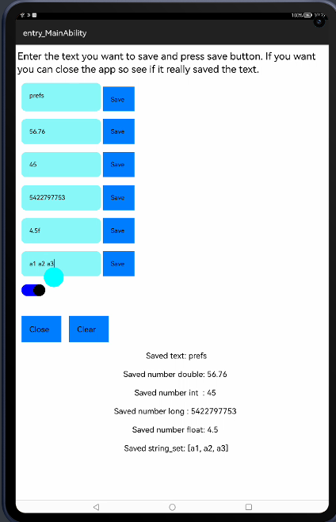

[](https://github.com/applibgroup/Prefs/actions/workflows/main.yml)

[](https://sonarcloud.io/dashboard?id=applibgroup_Prefs)

# Prefs

## Introduction

A small library containing a wrapper/helper for the Preferences of openharmony.
<p>
	
</p>


# Source
This library has been inspired by [GrenderG/Prefs](https://github.com/GrenderG/Prefs).


## Integration

1. For using Prefs module in sample app, include the source code and add the below dependencies in entry/build.gradle to generate hap/support.har.
```
    implementation project(path: ':lib')
```
2. For using Prefs module in separate application using har file, add the har file in the entry/libs folder and add the dependencies in entry/build.gradle file.
```
  implementation fileTree(dir: 'libs', include: ['*.jar', '*.har'])
```
3. For using MaterialCalendar module from a remote repository in separate application, add the below dependencies in entry/build.gradle file.
```
implementation 'dev.applibgroup:prefs:1.0.0'
```

## Usage

This is the basic usage, you can read values (specifying a default value or not) and write values like so:
``` java
  Prefs.with(yourContext).readInt(YOUR_KEY_VALUE);
  Prefs.with(yourContext).readInt(YOUR_KEY_VALUE, defaultValue);

  Prefs.with(yourContext).writeInt(YOUR_KEY_VALUE, valueToStore);
```
You can also specify a custom name for the preferences' name:
``` java
  Prefs.with(yourContext, "CUSTOM_NAME").readInt(YOUR_KEY_VALUE);
```
And force the re-instantiation of the Prefs instance:
``` java
  Prefs.with(yourContext, true).readInt(YOUR_KEY_VALUE);
  Prefs.with(yourContext, "CUSTOM_NAME", true).readInt(YOUR_KEY_VALUE);
```


You can use simple one-line methods to save values to the Preferences anywhere in your app, such as:

- `Prefs.putString(key, string)`
- `Prefs.putLong(key, long)`
- `Prefs.putBoolean(key, boolean)`

Retrieving data from the Preferences can be as simple as:

    String data = Prefs.getString(key, default value)

If the Preferences contains the key, the string will be obtained, otherwise the method returns the default string provided. No need for those pesky `hasKey()` or `data != null` checks!

For some examples, see the sample App.

## License
```

Copyright (C) 2020-21 Application Library Engineering Group

Licensed under the Apache License, Version 2.0 (the "License");
you may not use this file except in compliance with the License.
You may obtain a copy of the License at

http://www.apache.org/licenses/LICENSE-2.0

Unless required by applicable law or agreed to in writing, software
distributed under the License is distributed on an "AS IS" BASIS,
WITHOUT WARRANTIES OR CONDITIONS OF ANY KIND, either express or implied.
See the License for the specific language governing permissions and
limitations under the License.


```
